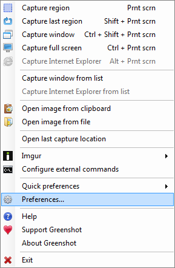
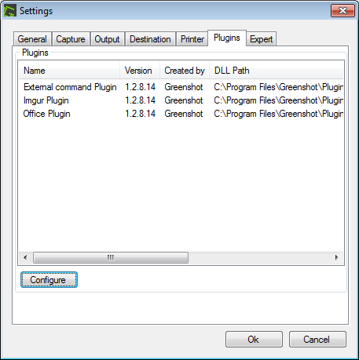
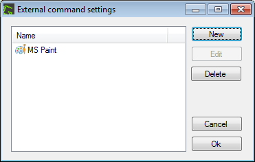
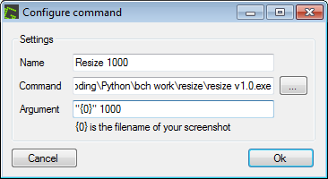
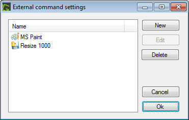
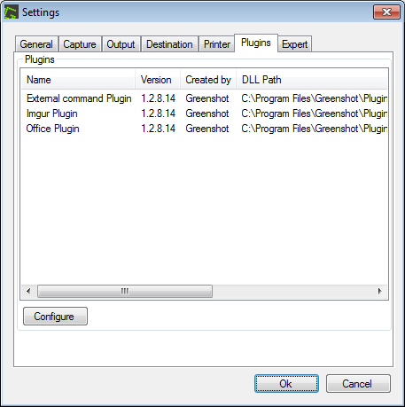
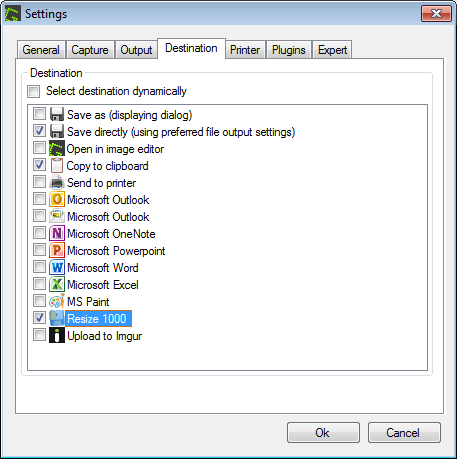

# Resizing images on the fly

When taking screenshots on a screen with a large resolution, you might want to reszie the images to say 1000px wide (or a value of your choice).

This can easily be achieved by the use of a free program I've created called Resize. 

Download [Resize](https://github.com/MrSimonC/resize/blob/master/dist/resize.exe) and save to a location of your choice. You can see it's code [here](https://github.com/MrSimonC/resize/). 

In Greenshot, open preferences:

Then Plugins tab, External command plugin, Configure

Click New

Fill out the configure command dialogue:

* Name: _"Resize 1000"_ (for example)
* Command: _Path to the resize.exe_
* Argument:
  * `"{0}" 1000` for widths of 1000 put in a sub-folder called "resized" _(i.e. a default subfolder name)_
  * `"{0}" 500` for widths of 500 put in a sub-folder called "resized" _(i.e. a default subfolder name)_
  * `"{0}" 1000 thumbs` for widths of 1000 put in a sub-folder called "thumbs"

Press OK

Press OK

OK, then quit and reopen Greenshot

Open Preferences

Activate your new command!

Now when you take a screenshot the picture will be placed in your "Output" folder (speficied in the Greenshot Output tab) but in a subfolder (called "resized" - or a sub folder name of your choice.)